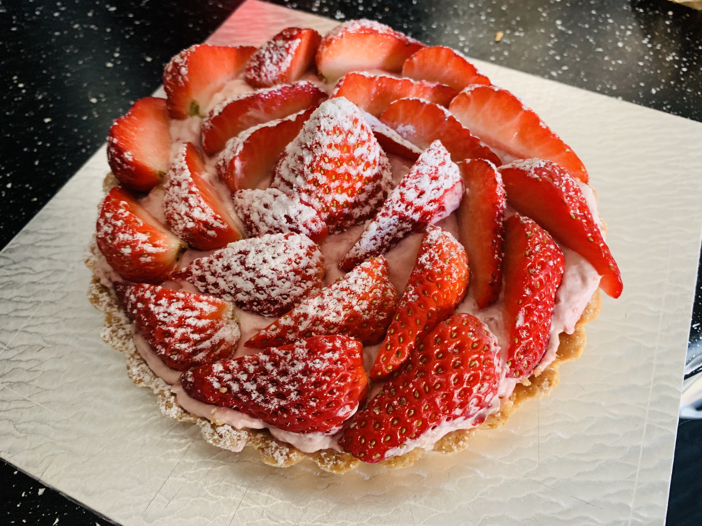
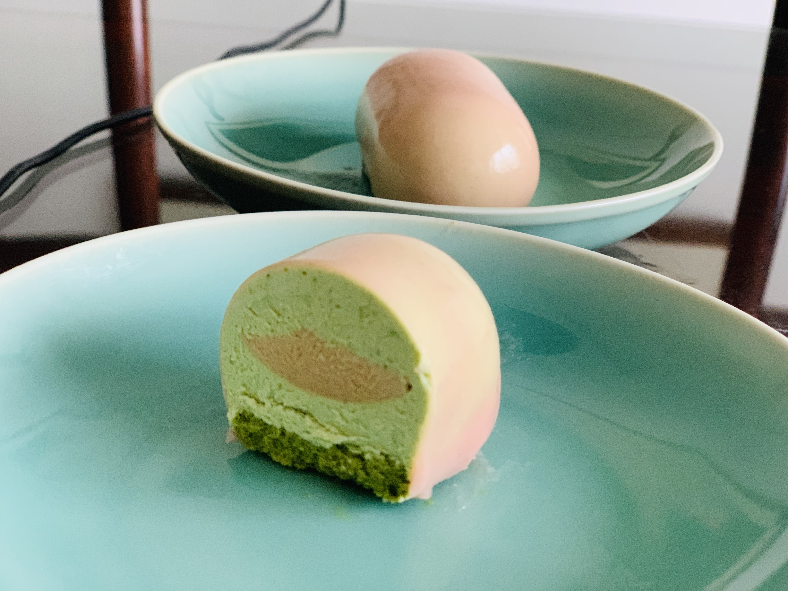
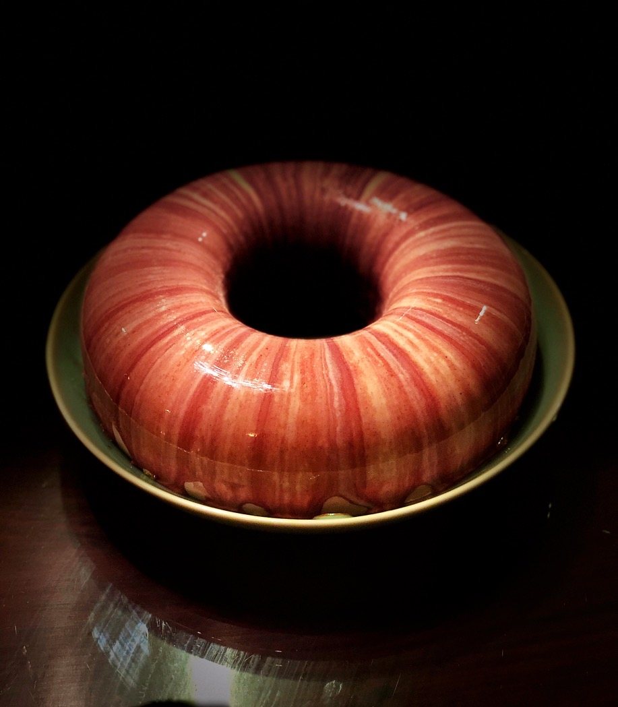

# This is Yiming's website  

 &nbsp; &nbsp; &nbsp; &nbsp;  &nbsp; I'm Yiming Zhao. Welcome to my website! I am a first year Biostatistic master student in TM track. I come from Beijing, China.  My hobbies are baking, traveling and reading. My favourite quote is : " Numen Lumen." Oh, I forgot to say, I have a British Shorthair cat. His name is cat. hahaha   
 &nbsp; &nbsp; &nbsp; &nbsp; As a freshman mailman student, I would be very happy to introduce myself from both my education experience and my life. Are you ready to take a close look at my life ?!  

    

&nbsp;

## My Photo  

    
   

 
&nbsp;

 
&nbsp;

## Education and Professional

[Education](education.html)  

 
&nbsp;

 
## My life photo {.tabset}

### Baking  

Here are cakes that I made:

    
   
   

### My Cat  

Here are photos and a short video of my cat

  
 
 <video width="75%" height="450" controls>
  <source src="image/cat.mp4" type="video/mp4">
</video>

 