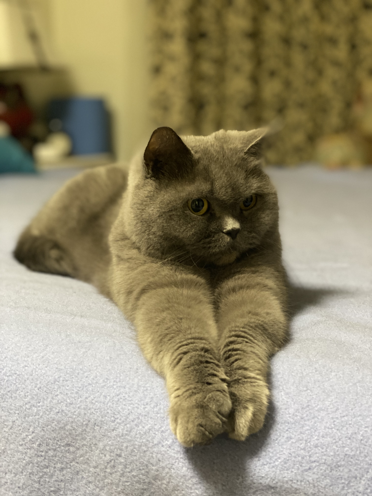

# This is Yiming's website  

 &nbsp; &nbsp; &nbsp; &nbsp;  I'm Yiming Zhao. Welcome to my website! I am a first year Biostatistic master student in TM track. I come from Beijing, China.  My hobbies are baking, traveling and reading. My favourite quote is : " Numen Lumen." Oh, I forgot to say, I have a British Shorthair cat. His name is cat. hahaha   
 &nbsp; &nbsp; &nbsp; &nbsp; As a freshman mailman student, I would be very happy to introduce myself from both my education experience and my life. Are you ready to take a close look at my life ?!  

    

&nbsp;

## My Photo  

    
   
## My cat  

    
   
 

 
&nbsp;

 
&nbsp;

## Education and Professional Experience

[Education](education.html)  

## Quarterly Results {.tabset}

### By Product  

This is my first tab and I can do stuff

### By Region  

This is my second tab and it does other stuff

 